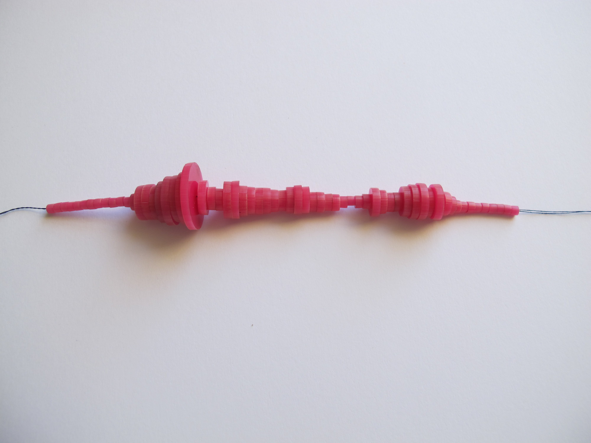
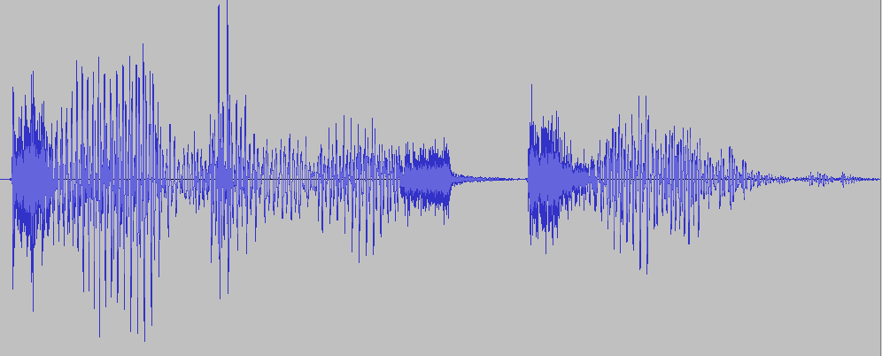
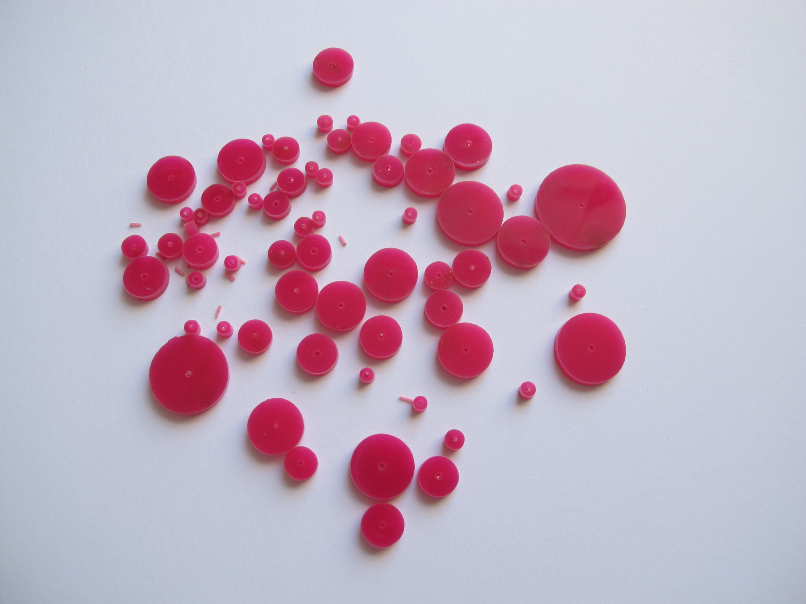
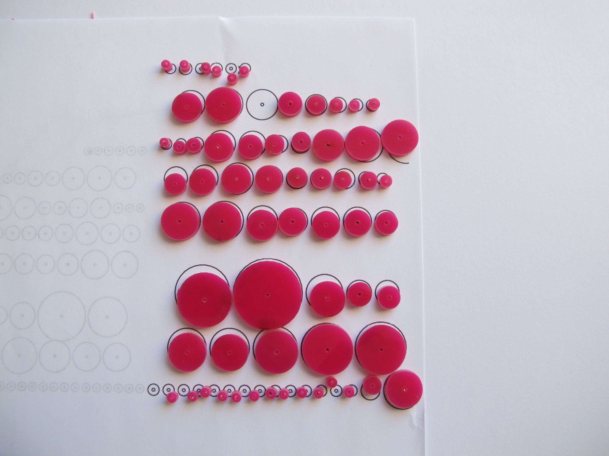

% Waveform
% Matt Venn
%

# Waveform!

Waveform is a computer science project that aims to make programming more 'real' by using computer programs to make physical objects. 

This project was inspired by the [waveform necklace](http://www.instructables.com/id/Waveform-Necklace-Bracelet/).

We'll be making a necklace or a keyring like this:

\ 

From an audio recording like this:

\ 

Each student can record their own phrase or sound, and then turn it into a physical object.

This is a bit of an experiment. I'll cover the basics but you'll have to fill in the missing parts. If you try it, please let us know how you got on.

# Prerequisites

* A laser cutter at your school and a good relationship with the DT department! The beads take about 5 minutes per student to cut. Ask them if they can try to cut the [circles.eps](circles.eps) file. This is the format we'll be providing. Ask for a sample of the material and find out its thickness. They may need to change the line width of the lines.
* Basic Python programming experience. Turtle library familiarity would be useful. We have some lesson plans for getting started with Python and Turtle over at [The Turtle Prize](http://turtleprize.com).
* Printer, paper for printing the patterns on.
* Needles, strong thread, necklace/keyring joining bits.

# What we'll cover

* syntax errors,
* file IO,
* Turtle library,
* basic maths related to circles,
* functions,
* problem solving.

# Lesson 1

## Introduction and recording audio

* Introduce the idea of writing a program that will produce plans for use with a laser cutter.
* Show some pictures of the necklace and explain how it was made from an audio recording. The recording was me saying 'coding is cool'!
* Have a look at the [instructable](http://www.instructables.com/id/Waveform-Necklace-Bracelet/). What are the advantages and disadvantages of doing it this way?
* Get your students to think of a phrase they'd like to turn into a keyring or necklace.
* Use [Audacity](http://audacity.sourceforge.net/) or another recording program to record the samples. They should be mono, 44.1Khz.

# Lesson 2

## slice_wav.py

* Get your students working in pairs.
* Explain that Matt the mad professor came up with a computer program to analyse and split the wav files, but he's a bad typist and so the students need to find and fix my syntax errors. The file is called [slice_wav_broken.py](slice_wav_broken.py). You can see a working version [here](slice_wav.py).
* slice_wav.py works by slicing a wav file into a number of segments and then averages each segment to produce an average volume. It then writes all the slices out to a CSV file called [results.csv](results.csv).
* Ask students to modify the program so that it asks how many slices they want. 
* Think about how many slices you want. If you're using 3mm material then 100 slices would end up with a necklace 300mm long!

# Lesson 3

## Drawing circles with lines

* Get students to work in 4s to solve this problem.
* Explain that we can make the laser cutter patterns by using the Turtle library. However, we first need to write a circle drawing function. Discuss with your students how we could draw a circle using only the turtle commands `forward()` and `turn()`. Invite your students to walk around like robots or draw pictures.
* Next move on and ask how the circle's size and smoothness relate to the number of `forward()` commands and the angle turned.
* Keep working and end up with an equation that relates a circle's radius and smoothness to the number of `forward()` and `turn()` commands.
* Try to solve it yourself first and then model your problem solving skills for the students.

~~~
    c = 2 * pi * r	   #circumference is 2 * Pi * r
    l = c / segments   #length of each segment is c / number of segments
    a = 360 / segments #angle to turn is 360 / number of segments
~~~

* Add some extra code so that you can specify the centre of the circle with an x and y co-ordinate.
* Encapsulate your code in a function so you can call it whenever you want a circle.
* See the program [circle.py](circle.py) if you get stuck with how to define and call functions.

# Lesson 4

## File IO

* Students working in pairs.
* Introduce file IO. File IO is really important because it let's us use the output of other programs or existing files (like the internet) as input to our programs. We'll use file IO to read results.csv from wav_slice.py and draw our circles.
* Show how to open and read a file using open() and readlines(). See the example [circle.py](circle.py) if you get stuck.
* Get your students to use their circle function from the previous lesson to draw a set of circles that represent all of the slices from their wav file, they'll need to scale the radius because the numbers from wav_slice.py are quite large.
* Now we need to space out our circles so that they can get laser cut. Ask your students how they can solve this problem and see if they can do it. If they need help then have a look at the example circle.py program.
* Add another circle inside each of the beads for the thread to go through. A radius of 2 worked well for me.
* Hide the turtle cursor using `hideturtle()` so that it doesn't get laser cut or printed.
* Add this line at the end of the program to export an eps file. Instead of using the filename 'circles.eps', use the student's name.

	getscreen().getcanvas().postscript(file="circles.eps")

## Tips for students

* Think about how long your piece will be. If the material is 3mm and you have 100 pieces then that's 30cm.
* For necklaces, avoid shapes that go from very small to very large, they don't hang very well.

# Laser cutting!

* You'll have to work this bit out yourself! Somehow provide all the files to the DT department and end up with each student's beads in a separate bag.

# Lesson 5

## Assembly

* Students working on their own.
* Print out each student's eps file and use this as a template. Make sure that the file isn't scaled. 
* Each student should lay out their beads on the template.
* Then use a needle and thread to thread the necklace or keyring together!

# Things that can cause problems

* Printing the template on paper is ok, but it was scaled and off centre, I had to turn off scale to fit and then some of it went off the edge.
* The smaller beads had the centers stuck inside, although this wasn't too annoying to get out with a needle.
* The profile of the necklace I made looks a little different to the actual wave, because of averaging?
* I would imagine that getting the beads back to the right student could be an issue. Make sure you have lots of little bags and get each student to write the name of their file on a piece of paper inside.
* Hide the turtle cursor so that it doesn't get laser cut or printed.
* I had to change the line width of the circles in the eps file to 'hairline' within corel draw.

